# 02 — Current System Architecture & API Discovery Approach

**المرحلة:** 1 — Current Architecture
**تاريخ اللقطة:** 2026-07-16 (Firefly III `6.6.6` @ `cdf1721e`)
**الحالة:** ✅ مكتمل. المخططات مبنية على بنية الكود الفعلية.

> **مستوى الثقة:** المخططات المعمارية عالية المستوى (Context / Container / Component /
> Auth / API Request) **مؤكدة** من `routes/api.php`, `bootstrap/app.php`, `app/Api/**`,
> `app/Transformers/**`. تدفقات الحسابات التفصيلية (Budget / Report / Currency) معروضة
> هنا **على مستوى معماري** فقط؛ المعادلات الرقمية الدقيقة تُوثّق في
> `04-financial-calculations.md` (المرحلة 3) بعد فحص كل service على حدة.

---

## 1. System Context Diagram (C4 — Level 1)

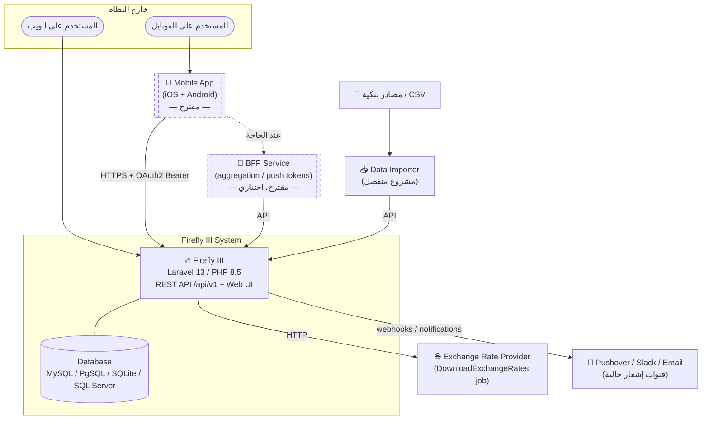

**نقاط مؤكدة:** Firefly III يعرض REST API + Web UI فوق قاعدة بيانات واحدة؛ الإشعارات
عبر Pushover/Slack/Email؛ أسعار الصرف تُجلب عبر job؛ الاستيراد عبر مشروع منفصل.
**نقاط مقترحة (dashed):** تطبيق الموبايل وخدمة BFF.

---

## 2. Container Diagram (C4 — Level 2)

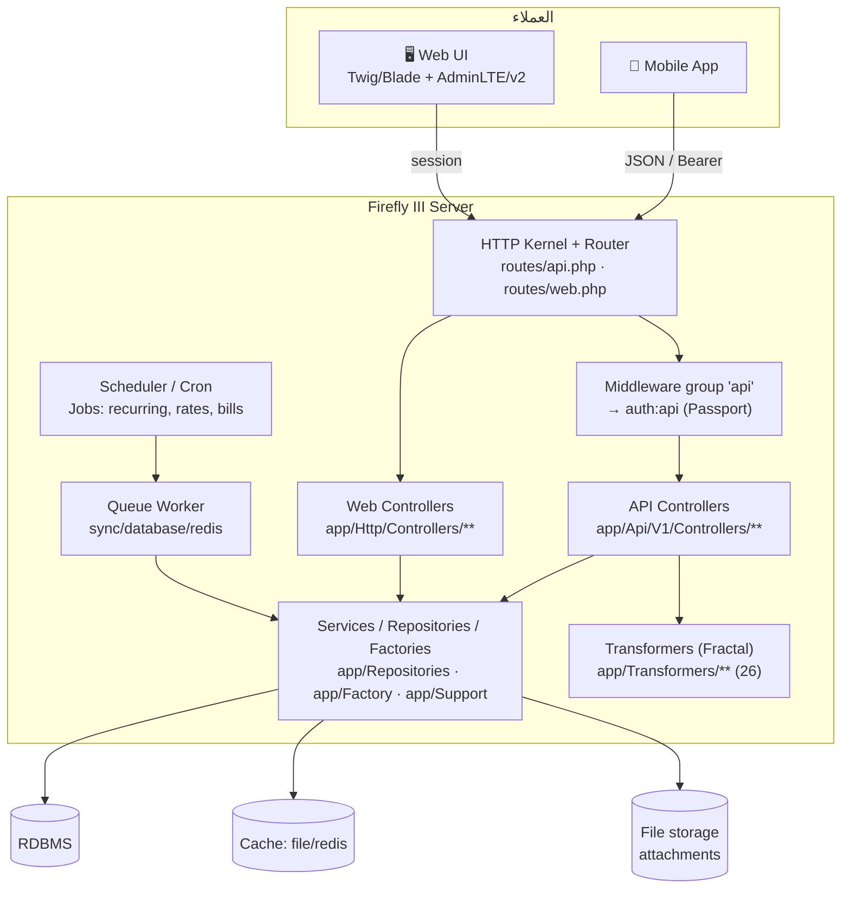

**المصدر:** `bootstrap/app.php:109-113` (تعريف مجموعة `api` مع `auth:api`)؛
`app/Api/V1/Controllers/**`؛ `app/Transformers/**`؛ `app/Jobs/**`.

---

## 3. Component Diagram — API Layer (C4 — Level 3)

تنظيم الـ API Controllers كما هو فعليًا في `app/Api/V1/Controllers/`:

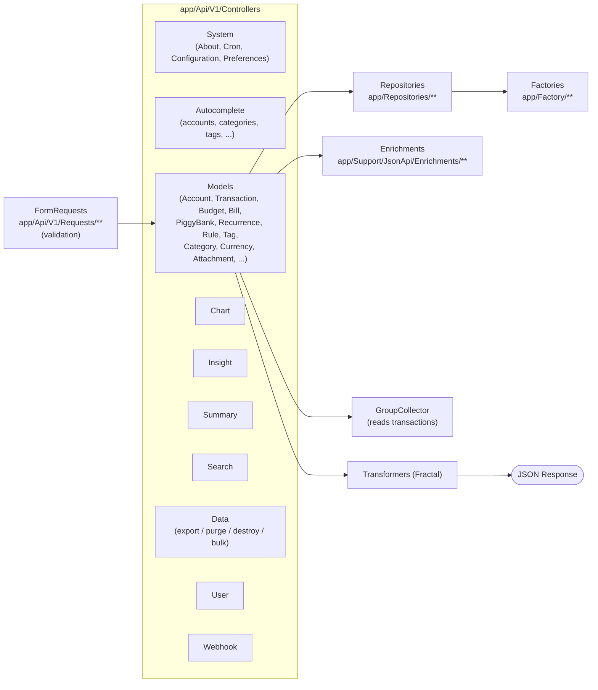

**المصدر:** `ls app/Api/V1/Controllers/` → المجلدات: `Autocomplete, Chart, Controller.php,
Data, Insight, Models, Search, Summary, System, User, Webhook`.
`app/Api/V1/Controllers/Models/` → `Account, Attachment, AvailableBudget, Bill, Budget,
BudgetLimit, Category, CurrencyExchangeRate, ObjectGroup, PiggyBank, Recurrence, Rule,
RuleGroup, Tag, Transaction, TransactionCurrency, TransactionLink, TransactionLinkType,
UserGroup`.

---

## 4. Authentication Flow (Passport / OAuth2 + PAT)

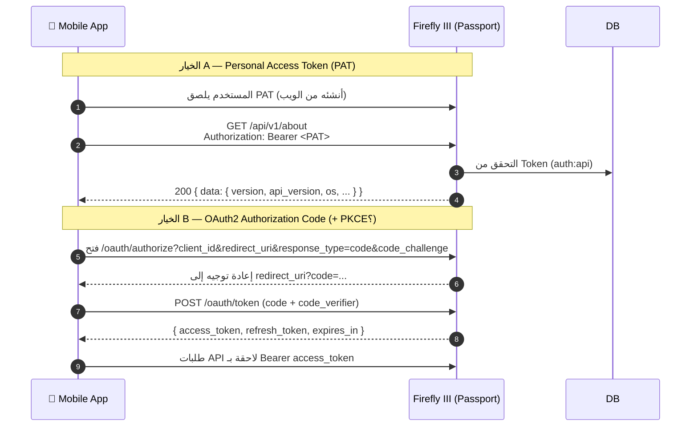

**مؤكد:** الحارس `auth:api` (Passport) على كل `/api/v1` (`bootstrap/app.php:113`).
Passport يوفّر PAT و OAuth2. نقطة التحقق العملية `/api/v1/about` (System controller).
**غير مؤكد — يحتاج تحقق (المرحلة 9):** دعم **PKCE** لعملاء الموبايل العامّين (public
clients)، سلوك **refresh token** ومدد الصلاحية الفعلية، وإتاحة **2FA** أثناء تدفق الـ API.

---

## 5. API Request Flow (المسار العام لأي طلب)

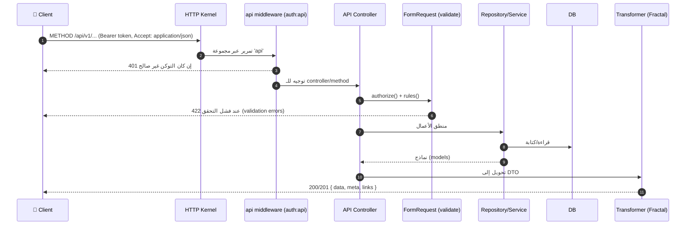

**مؤكد:** ترتيب Kernel → `auth:api` → Controller → FormRequest → Repository → Transformer.
رموز الحالة القياسية: `401` غير مصرّح، `422` فشل تحقق، `403` صلاحية، `404` غير موجود.
التفاصيل الكاملة لكل endpoint في `11-api-catalog.md` و `12-api-request-response-examples.md`.

---

## 6. Transaction Creation Flow (Withdrawal / Deposit / Transfer)

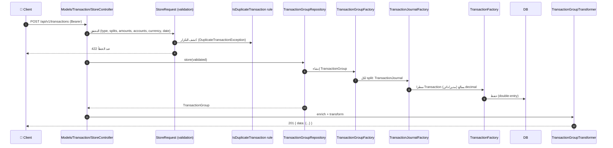

**المصدر (مؤكد):** `app/Api/V1/Controllers/Models/Transaction/StoreController.php`
(imports: `StoreRequest`, `DuplicateTransactionException`, `TransactionGroupRepositoryInterface`,
`IsDuplicateTransaction`, `TransactionGroupEnrichment`, `GroupCollectorInterface`)؛
`app/Factory/TransactionGroupFactory.php`, `TransactionJournalFactory.php`, `TransactionFactory.php`.

**بنية مؤكدة:** المعاملة = **TransactionGroup** ⟶ عدّة **TransactionJournal** (splits) ⟶
كل journal يولّد سطرين **Transaction** (قيد مزدوج double-entry). المبالغ **decimal strings**.
تفاصيل قواعد الحساب والقيود المحاسبية: `04-financial-calculations.md`.

---

## 7. Recurring Transaction Flow

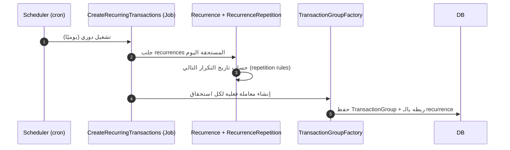

**المصدر (مؤكد):** `app/Jobs/CreateRecurringTransactions.php`؛ نماذج `Recurrence`,
`RecurrenceRepetition`, `RecurrenceTransaction`, `RecurrenceMeta`.
**غير مؤكد — يحتاج تحقق:** خوارزمية حساب «تاريخ التكرار التالي» الدقيقة (نهاية الشهر،
السنة الكبيسة) — تُوثّق في المرحلة 3.

---

## 8. Budget Calculation Flow (عالي المستوى)

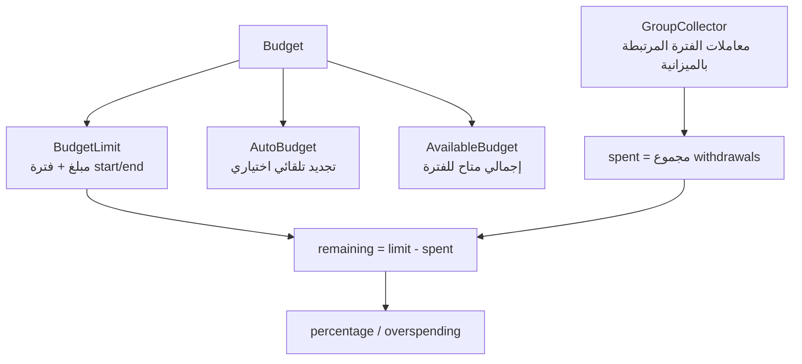

**المصدر (مؤكد):** نماذج `Budget`, `BudgetLimit`, `AutoBudget`, `AvailableBudget`؛
job `CreateAutoBudgetLimits`؛ endpoints `/api/v1/budgets` + `/api/v1/available-budgets`
+ `/api/v1/chart/budget/overview`.
**⚠️ المعادلات الرقمية الدقيقة (حدود الفترة، rollover، تعدّد الـ limits، تضمين المعاملات،
العملات) تُوثّق في `04-financial-calculations.md` بعد فحص الـ services المعنية. لا تُعتمد
من هذا المخطط.**

---

## 9. Report Calculation Flow (عالي المستوى)

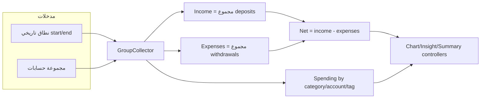

**المصدر (مؤكد):** `app/Api/V1/Controllers/{Chart,Insight,Summary}`؛
`app/Helpers/Collector/GroupCollector`؛ `app/Support/Http/Api/{AccountBalanceGrouped,
SummaryBalanceGrouped}.php`.
**⚠️ الصيغ الدقيقة (cash flow, savings rate, forecast, burn rate, runway) تُوثّق في
المرحلة 3.**

---

## 10. Currency Conversion Flow

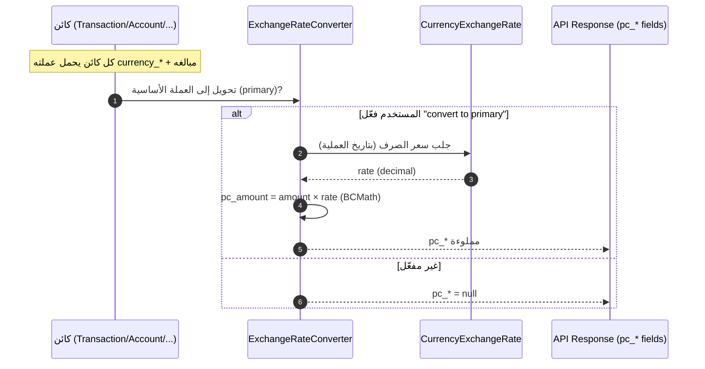

**المصدر (مؤكد):** `docs/references/firefly-iii/api/index.md` (شرح `currency_*`,
`primary_currency_*`, `pc_*`, `object_has_currency_setting`)؛
`app/Support/Http/Api/ExchangeRateConverter.php`؛ نموذج `CurrencyExchangeRate`؛
endpoints `/api/v1/exchange-rates/**` (`routes/api.php:93-120`).
**قاعدة مؤكدة:** إذا لم يفعّل المستخدم «convert to primary» فكل حقول `pc_*` = `null`؛
وإن تطابقت عملة الكائن مع الأساسية فـ `pc_amount == amount`.
**⚠️ قواعد التقريب والدقة العشرية وسعر الصرف العكسي/المباشر تُوثّق في المرحلة 3.**

---

## 11. Notification Flow (الحالي في Firefly III)

```mermaid
graph LR
    Ev[أحداث/Jobs<br/>WarnAboutBills · RuleActionFailed · SubscriptionsOverdue] --> NS[NotificationSender<br/>app/Notifications]
    NS --> Ch{via() channels}
    Ch --> Mail[Mail]
    Ch --> Push[Pushover]
    Ch --> Slack[Slack]
    Ch -. معلّق .-> Ntfy[ntfy]
    Push -. ❌ ليست FCM/APNs .-> X[لا Push للموبايل]
```

**المصدر (مؤكد):** `app/Notifications/**` (`NotificationSender`, `ReturnsAvailableChannels`,
`User/RuleActionFailed`, `User/SubscriptionsOverdueReminder`)؛ تبعيات Pushover/Slack.
**⚠️ فجوة مؤكدة:** لا يوجد **Firebase Cloud Messaging / APNs** ولا **device token
registration** — تطبيق الموبايل يحتاج backend إضافي للإشعارات (المرحلة 7).

---

## 12. Data Import Flow

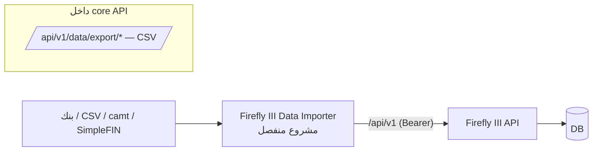

**المصدر (مؤكد):** التوثيق الرسمي + `readme.md`؛ الاستيراد عبر مشروع
`firefly-iii/data-importer` المستقل. التصدير فقط ضمن core (`routes/api.php:173-189`).
**الأثر على الموبايل:** «bank sync» ليست خاصية core API؛ تُعامَل كفجوة (المرحلة 7).

---

## 13. API Discovery Approach (منهجية المرحلة 6)

لبناء `11-api-catalog.md` بدقة دون تخمين، سيُستخرج كل endpoint من **خمسة مصادر متقاطعة**،
وتُعتمد النتيجة فقط عند اتفاق المصادر:

| # | المصدر | ما يُستخرج منه | المسار |
|---|---|---|---|
| 1 | **Route definitions** | Method, URI, name, controller@action, middleware/scopes | `routes/api.php` (853 سطر) |
| 2 | **Controllers** | المنطق، الـ query params، رموز الحالة | `app/Api/V1/Controllers/**` |
| 3 | **FormRequests** | Required/optional fields + validation rules | `app/Api/V1/Requests/**` |
| 4 | **Transformers (Fractal)** | شكل الـ Response DTO + includes | `app/Transformers/**` (26) |
| 5 | **OpenAPI/Swagger الرسمي** | التوثيق المرجعي للتحقق المتقاطع | `https://api-docs.firefly-iii.org/` |

**قواعد الاستخراج:**

1. لا يُدرَج endpoint غير موجود في `routes/api.php`.
2. لا يُدرَج request field غير موجود في الـ FormRequest المقابل.
3. عند تعارض Swagger مع الكود → **الكود هو المرجع**، ويُسجّل التعارض في `25-open-questions.md`.
4. كل صف في الكتالوج يحمل عمود **Source file** إلزاميًا.
5. تُصنَّف كل قدرة إلى: متاح API / ويب فقط / يحتاج backend / محلي فقط (Gap Analysis، المرحلة 7).

**المجموعات المستهدفة (من `routes/api.php`):** About, Autocomplete, Accounts, Transactions,
Categories, Tags, Budgets, Budget-limits, Bills, Piggy-banks, Recurrences, Rules,
Rule-groups, Currencies, Exchange-rates, Preferences, Users, Attachments, Webhooks,
Charts, Insight, Summary, Search, Data (export/purge/destroy/bulk), Configuration,
Object-groups, Available-budgets, Transaction-links.

---

## 14. ملخص «مؤكد / غير مؤكد» لهذه الوثيقة

| البند | الحالة |
|---|---|
| بنية C4 (Context/Container/Component) | ✅ مؤكد من الكود |
| `auth:api` (Passport) على كل `/api/v1` | ✅ مؤكد (`bootstrap/app.php:113`) |
| بنية المعاملة (Group→Journal→Transaction, double-entry) | ✅ مؤكد (Factories) |
| نموذج العملات (`currency_*`/`primary_*`/`pc_*`) | ✅ مؤكد (docs API) |
| دعم PKCE / سلوك refresh token / 2FA عبر API | ❓ غير مؤكد — المرحلة 9 |
| المعادلات الرقمية (Budget/Report/Currency/Recurrence) | ❓ عالي المستوى فقط — المرحلة 3 |
| Push notifications (FCM/APNs) | ❌ غير موجود — فجوة مؤكدة |
| Bank sync / Import ضمن core | ❌ مشروع منفصل — فجوة مؤكدة |

**التالي:** إغلاق أسئلة المصادقة والحسابات في المرحلتين 2 و3 قبل اعتماد أي متطلب منتج.
