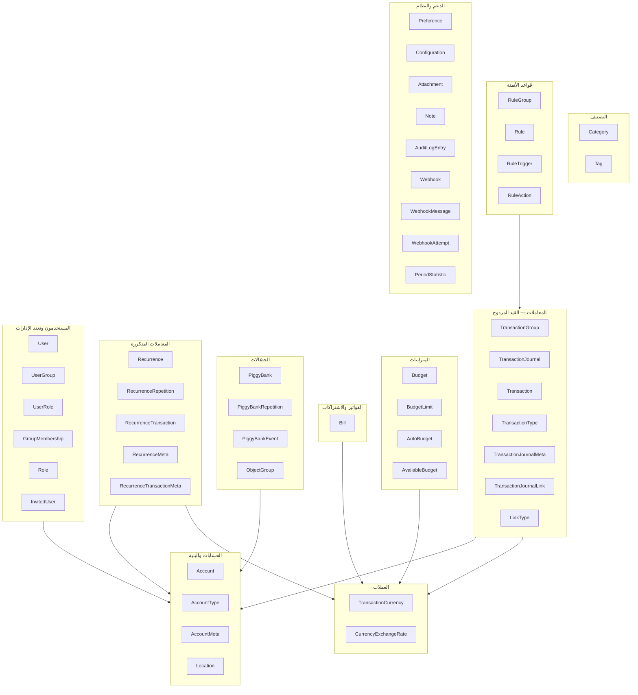
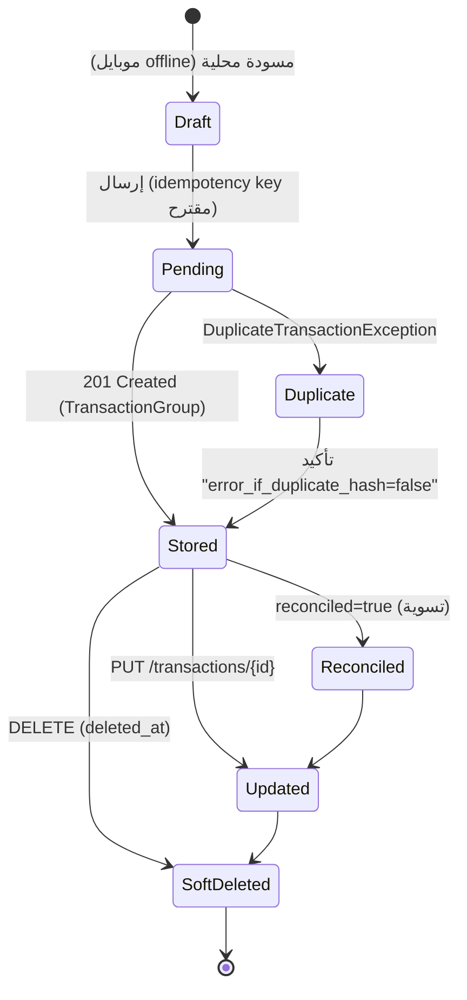
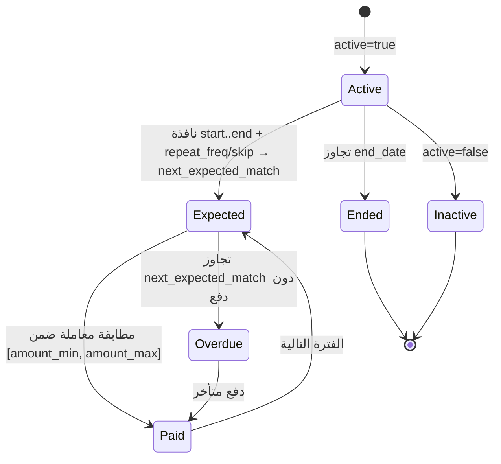
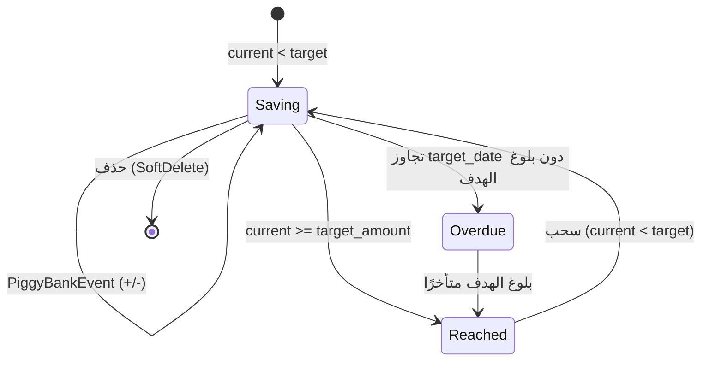
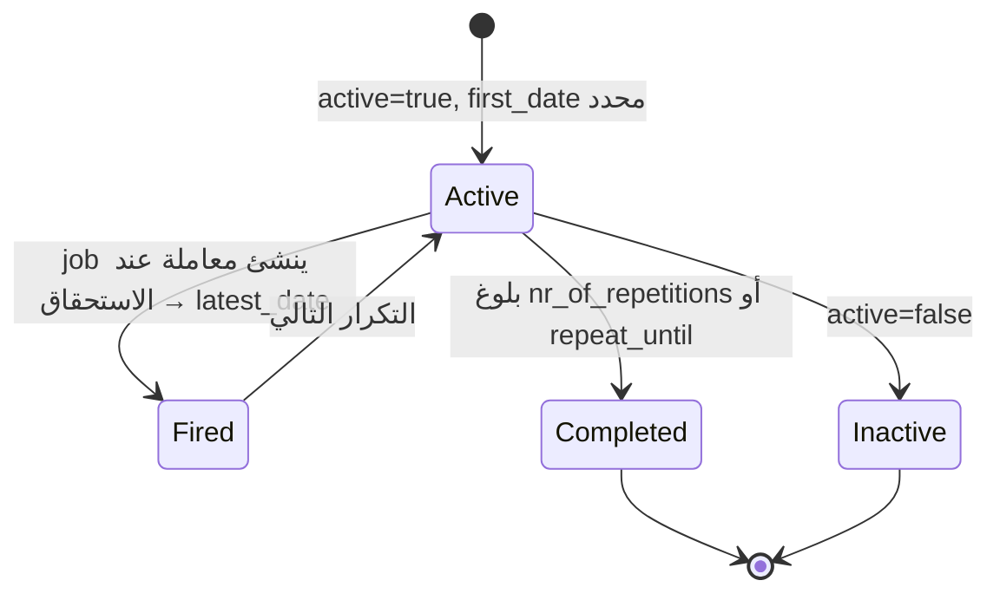
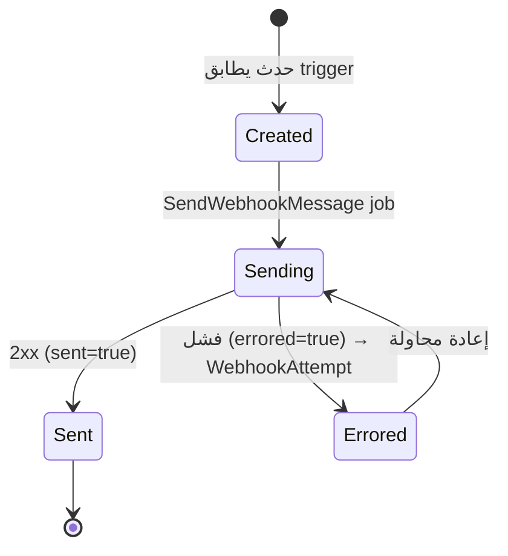

# 03 — Domain Model (نموذج المجال المالي)

**المرحلة:** 2 — فهم المجال المالي
**تاريخ اللقطة:** 2026-07-16 (Firefly III `6.6.6` @ `cdf1721e`)
**الحالة:** ✅ مكتمل. مبني على فحص فعلي لـ **50 model** + **60 migration** + FormRequests + Transformers + Enums.

> **منهجية الاستخراج:** لكل كيان جرى فحص: ملف الـ Model (`$fillable`, `$casts`, relationships,
> SoftDeletes)، migration الإنشاء (أنواع الأعمدة + required/nullable)، الـ FormRequest المقابل
> (قواعد التحقق)، الـ Transformer (شكل الإخراج + `object_has_currency_setting`)، والـ Enum.
> كل حقيقة تحمل مرجعها `— المصدر: path:line`. ما لم يُتحقق منه موسوم **«غير مؤكد — يحتاج تحقق»**.

> **قاعدة مالية عابرة (مؤكدة):** كل الحقول المالية مُعرَّفة `decimal(32,12)` في قاعدة البيانات
> وتُقرأ/تُخزَّن كـ **strings** (`$casts => 'string'`) للحفاظ على دقة **BCMath** — لا float أبدًا.
> — المصدر: `database/migrations/2016_06_16_000002_create_main_tables.php:590`، `app/Models/Transaction.php:175-193`.
> ⟶ يُلزم تطبيق الموبايل باستخدام decimal string / minor-units في كل الطبقات.

---

## 1. خريطة مجموعات المجال (Domain Groups)

---

## 2. Entity Relationship Diagram (ERD)

> ملاحظة: `user_group_id` (nullable) موجود على معظم الكيانات (طبقة multi-tenancy أُضيفت في
> `2021_08_28_073733_user_groups.php`)؛ حُذف من المخطط لتقليل الضجيج ما عدا حيث يلزم.

```mermaid
erDiagram
    USER ||--o{ ACCOUNT : owns
    USER ||--o{ TRANSACTION_GROUP : owns
    USER ||--o{ BUDGET : owns
    USER ||--o{ CATEGORY : owns
    USER ||--o{ TAG : owns
    USER ||--o{ BILL : owns
    USER ||--o{ RECURRENCE : owns
    USER ||--o{ RULE_GROUP : owns
    USER ||--o{ WEBHOOK : owns
    USER ||--o{ PREFERENCE : has
    USER }o--o{ ROLE : "role_user"
    USER }o--o| USER_GROUP : "active admin"
    USER ||--o{ GROUP_MEMBERSHIP : has
    USER_GROUP ||--o{ GROUP_MEMBERSHIP : contains
    USER_ROLE ||--o{ GROUP_MEMBERSHIP : grants

    ACCOUNT_TYPE ||--o{ ACCOUNT : classifies
    ACCOUNT ||--o{ ACCOUNT_META : has
    ACCOUNT ||--o{ TRANSACTION : "source/dest"
    ACCOUNT }o--o{ PIGGY_BANK : "account_piggy_bank"

    TRANSACTION_GROUP ||--o{ TRANSACTION_JOURNAL : "splits"
    TRANSACTION_TYPE ||--o{ TRANSACTION_JOURNAL : types
    TRANSACTION_JOURNAL ||--|{ TRANSACTION : "2 rows (double-entry)"
    TRANSACTION_JOURNAL ||--o{ TRANSACTION_JOURNAL_META : has
    TRANSACTION_JOURNAL }o--o{ BUDGET : tagged
    TRANSACTION_JOURNAL }o--o{ CATEGORY : tagged
    TRANSACTION_JOURNAL }o--o{ TAG : tagged
    TRANSACTION_JOURNAL ||--o{ PIGGY_BANK_EVENT : triggers
    LINK_TYPE ||--o{ TRANSACTION_JOURNAL_LINK : classifies
    TRANSACTION_JOURNAL ||--o{ TRANSACTION_JOURNAL_LINK : "source/dest"

    TRANSACTION_CURRENCY ||--o{ TRANSACTION : denominates
    TRANSACTION_CURRENCY ||--o{ TRANSACTION_JOURNAL : denominates
    TRANSACTION_CURRENCY ||--o{ CURRENCY_EXCHANGE_RATE : "from/to"
    TRANSACTION_CURRENCY ||--o{ BUDGET_LIMIT : denominates

    BUDGET ||--o{ BUDGET_LIMIT : has
    BUDGET ||--o{ AUTO_BUDGET : "auto (0..1)"
    BUDGET }o--o{ TRANSACTION : spent
    USER ||--o{ AVAILABLE_BUDGET : has

    BILL ||--o{ TRANSACTION_JOURNAL : matches
    BILL }o--o{ OBJECT_GROUP : grouped

    PIGGY_BANK ||--o{ PIGGY_BANK_REPETITION : has
    PIGGY_BANK ||--o{ PIGGY_BANK_EVENT : has
    PIGGY_BANK }o--o{ OBJECT_GROUP : grouped

    RECURRENCE ||--o{ RECURRENCE_REPETITION : has
    RECURRENCE ||--o{ RECURRENCE_TRANSACTION : has
    RECURRENCE ||--o{ RECURRENCE_META : has
    RECURRENCE_TRANSACTION ||--o{ RECURRENCE_TRANSACTION_META : has

    RULE_GROUP ||--o{ RULE : contains
    RULE ||--o{ RULE_TRIGGER : has
    RULE ||--o{ RULE_ACTION : has

    WEBHOOK ||--o{ WEBHOOK_MESSAGE : emits
    WEBHOOK_MESSAGE ||--o{ WEBHOOK_ATTEMPT : has

    ATTACHMENT }o--|| USER : owns
    NOTE }o--|| USER : "via noteable"
```

**علاقات polymorphic (morph):** `Attachment.attachable`, `Note.noteable`, `Location.locatable`,
`ObjectGroup(object_groupable)`, `AuditLogEntry.auditable/changer`, `PeriodStatistic.primary_statable`.
الموديلات القابلة للإرفاق: `Account, Bill, Budget, Category, PiggyBank, Tag, Transaction,
TransactionJournal, Recurrence` — المصدر: `config/firefly.php:214-224`.

---

## 3. مرجع التعدادات (Enumerations Reference)

### 3.1 AccountTypeEnum — 14 نوعًا
— المصدر: `app/Enums/AccountTypeEnum.php:30-46` + `database/seeders/AccountTypeSeeder.php:39-42`

`Asset account`, `Beneficiary account`, `Cash account`, `Credit card`, `Debt`,
`Default account`, `Expense account`, `Import account`, `Initial balance account`,
`Liability credit account`, `Loan`, `Mortgage`, `Reconciliation account`, `Revenue account`.

**التصنيف الوظيفي للموبايل:** Asset/Default/Cash/Credit card = حسابات أصول؛ Expense/Beneficiary =
مصروفات؛ Revenue = دخل؛ Loan/Debt/Mortgage/Liability credit = التزامات؛
Initial balance/Reconciliation/Import = حسابات نظامية (لا تُعرض عادةً للمستخدم مباشرة).

### 3.2 TransactionTypeEnum — 7 أنواع
— المصدر: `app/Enums/TransactionTypeEnum.php:30-38` + `database/seeders/TransactionTypeSeeder.php:41-43`

`Withdrawal`, `Deposit`, `Transfer`, `Opening balance`, `Reconciliation`, `Liability credit`, `Invalid`.
قيم الإدخال عبر API: `withdrawal, deposit, transfer, opening-balance, reconciliation`
(تُطبَّع إلى القيم أعلاه) — المصدر: `app/Api/V1/Requests/Models/Transaction/StoreRequest.php:100`.

### 3.3 UserRoleEnum — 21 دورًا داخل الإدارة (UserGroup)
— المصدر: `app/Enums/UserRoleEnum.php:30-71`

`ro` (read-only), `mng_trx`, `mng_meta`, `read_budgets`, `read_piggies`, `read_subscriptions`,
`read_rules`, `read_recurring`, `read_webhooks`, `read_currencies`, `mng_budgets`, `mng_piggies`,
`mng_subscriptions`, `mng_rules`, `mng_recurring`, `mng_webhooks`, `mng_currencies`,
`view_reports`, `view_memberships`, `full`, `owner`.

> مهم: هذه أدوار **داخل الإدارة** (per-UserGroup). منفصلة عن أدوار النظام العامة في جدول
> `roles` (`owner`, `demo`) — المصدر: `app/Models/Role.php`, `UserStoreRequest.php:76`.

### 3.4 AutoBudgetType — 4 قيم
— المصدر: `app/Enums/AutoBudgetType.php:32-34` + `app/Api/.../Budget/UpdateRequest.php:70`

`none=0`, `reset=1`, `rollover=2`, `adjusted=3`. الفترات المسموحة `auto_budget_period`:
`daily, weekly, monthly, quarterly, half_year, yearly` — المصدر: `Budget/StoreRequest.php:92`.

### 3.5 Recurrence repetition types — 5 أنواع
— المصدر: `RecurringRepository.php:272-286` + `Recurrence/StoreRequest.php:90`

`daily`, `weekly`, `monthly`, `ndom` (nth day-of-month)، `yearly`.
معالجة عطلة نهاية الأسبوع `weekend` (RecurrenceRepetitionWeekend) — المصدر: `app/Enums/RecurrenceRepetitionWeekend.php:32-35`:
`1=DO_NOTHING`, `2=SKIP_CREATION`, `3=TO_FRIDAY`, `4=TO_MONDAY`. `repetition_skip`: يُحسب `skipMod = skip+1`.

### 3.6 Bill repeat_freq — 5 قيم
`weekly, monthly, quarterly, half-year, yearly` — المصدر: `Bill/StoreRequest.php:88`.
⚠️ **تنبيه اتساق:** الفواتير تستخدم `half-year` (شرطة)، بينما AutoBudget يستخدم `half_year`
(شرطة سفلية). يجب على الموبايل التفريق. (OQ جديد — انظر §10.)

### 3.7 Rule triggers & actions
- **Trigger execution moment (`trigger`):** `store-journal, update-journal, manual-activation`
  — المصدر: `Rule/StoreRequest.php:87`.
- **Trigger types:** ديناميكية من مفاتيح `config('search.operators')` (≈ عشرات العوامل: مطابقة
  الوصف/الحساب/المبلغ/الوسوم/التاريخ...) — المصدر: `app/Support/Request/GetRuleConfiguration.php:32-35` + `config/search.php`.
- **Action types (22):** `set_category, clear_category, set_budget, clear_budget, add_tag,
  remove_tag, remove_all_tags, set_description, set_source_account, set_destination_account,
  set_notes, clear_notes, link_to_bill, convert_withdrawal, convert_deposit, convert_transfer,
  switch_accounts, update_piggy, delete_transaction, set_source_to_cash, set_destination_to_cash,
  set_amount` — المصدر: `config/firefly.php:418-447`.

### 3.8 Webhook enums
- **Trigger (int):** `ANY=50, STORE_TRANSACTION=100, UPDATE_TRANSACTION=110, DESTROY_TRANSACTION=120,
  STORE_BUDGET=200, UPDATE_BUDGET=210, DESTROY_BUDGET=220, STORE_UPDATE_BUDGET_LIMIT=230` — `app/Enums/WebhookTrigger.php`.
- **Response (int):** `TRANSACTIONS=200, ACCOUNTS=210, BUDGET=230, RELEVANT=240, NONE=220` — `app/Enums/WebhookResponse.php`.
- **Delivery (int):** `JSON=300` فقط (XML معطّل) — `app/Enums/WebhookDelivery.php`.

### 3.9 LinkType seeds — 4 أنواع روابط
`Related`, `Refund`, `Paid`, `Reimbursement` — المصدر: `database/seeders/LinkTypeSeeder.php:39-42`.

---

## 4. كتالوج الكيانات (Entity Catalog)

> لكل كيان: الغرض · الجدول/الملف · الحقول الرئيسية (نوع/إلزامي) · العلاقات · SoftDeletes ·
> قواعد التحقق (API) · إعداد العملة · API endpoints · شاشة موبايل (forward-ref للمرحلة 5).

### أ. الحسابات والبنية

#### Account
- **الغرض:** كيان الحساب (أصل/مصروف/دخل/التزام/نقد...). القلب الذي تتحرك بينه المعاملات.
- **الملف/الجدول:** `app/Models/Account.php` / `accounts`.
- **الحقول:** `id`, `user_id`⚑, `account_type_id`⚑, `name`(1024)⚑, `virtual_balance`(dec,null),
  `iban`(null), `active`(bool)⚑, `encrypted`(bool,hidden), `order`(int), `user_group_id`(null),
  `native_virtual_balance`(dec,null). SoftDeletes ✅. — المصدر: `create_main_tables.php:97-110` + migrations.
- **العلاقات:** accountType(belongsTo), accountMeta(hasMany), transactions(hasMany),
  piggyBanks(belongsToMany), attachments/notes/locations(morphMany), objectGroups(morphToMany), user(belongsTo).
- **التحقق (StoreRequest):** `name` required≤1024 فريد للمستخدم؛ `type` required in{account types}؛
  `iban` iban+UniqueIban؛ `opening_balance` numeric + `opening_balance_date` (مترابطان)؛
  `account_role` required_if type=asset؛ `liability_type` in(loan,debt,mortgage) required_if
  type=liability؛ `liability_direction` in(credit,debit)؛ `interest` 0–100. — المصدر: `Account/StoreRequest.php:95-127`.
  ملاحظة: `account_type_id` يُشتق من نص `type`، لا يُملأ مباشرة.
- **العملة:** يحمل عملة خاصة عبر AccountMeta (`currency_id`). **الرصيد لا يُخزَّن كعمود؛ يُحسب**
  من مجموع `transactions.amount` (انظر `04-financial-calculations.md`).
- **API:** `GET/POST/PUT/DELETE /api/v1/accounts`, `/api/v1/accounts/{id}/transactions`,
  `/api/v1/accounts/{id}/attachments`, `/api/v1/accounts/{id}/piggy-banks`. — `routes/api.php:316`.
- **حذف/تعديل:** SoftDelete؛ حذف الحساب يؤثر على معاملاته (قيد cascade على transactions) — يحتاج
  تأكيد تأثير التقارير (المرحلة 3).

#### AccountType
- **الغرض:** جدول بحث lookup لأنواع الحسابات (14 نوعًا مبذورة).
- **الحقول:** `id`, `type`(50,unique)⚑. **لا SoftDeletes.** — المصدر: `create_support_tables.php:78-85`.
- **العلاقات:** accounts(hasMany). **قيمها ثابتة (seed-only)، لا API إنشاء.**

#### AccountMeta
- **الغرض:** بيانات وصفية key/value للحساب (مثل `currency_id`, `account_role`, `account_number`, BIC).
- **الحقول:** `id`, `account_id`⚑, `name`⚑, `data`(text/JSON)⚑. **لا SoftDeletes.** — المصدر: `create_main_tables.php:119-125`.
- **ملاحظة:** يُدار عبر Account request؛ لا API مستقل.

#### Location
- **الغرض:** إحداثيات جغرافية لكيان (حساب/journal/tag).
- **الحقول:** `id`, `locatable_id/type`(morph)⚑, `latitude/longitude`(dec 12,8,null), `zoom_level`(null).
  عمود `deleted_at` موجود لكن **الموديل لا يفعّل SoftDeletes trait**. — المصدر: `make_locations_table.php:53-63`, `Location.php:33-37`.
- **التحقق:** `latitude` -90..90, `longitude` -180..180, `zoom_level` 0..80 (مترابطة). — المصدر: `Location.php:42-49`.

### ب. المعاملات (القيد المزدوج)

> **البنية المؤكدة:** `TransactionGroup → TransactionJournal (split واحد أو أكثر) →
> Transaction (صفّان لكل journal: مصدر سالب + وجهة موجب)`. القيد المزدوج مفروض منطقيًا في طبقة
> Factory/Repository، لا بقيد DB. — المصدر: Factories + `TransactionJournal.php:210-213`.

#### TransactionGroup
- **الغرض:** حاوية المعاملة الواحدة أو المقسّمة (splits). يحمل `title` فقط، لا مبلغ/تاريخ.
- **الحقول:** `id`, `user_id`⚑, `title`(1024,null), `user_group_id`(null). SoftDeletes ✅.
- **العلاقات:** transactionJournals(hasMany), user(belongsTo).
- **API:** `GET/POST/PUT/DELETE /api/v1/transactions` (المجموعة هي وحدة الإنشاء). — `routes/api.php:606`.

#### TransactionJournal
- **الغرض:** «المعاملة المنطقية» الواحدة: النوع + الوصف + التاريخ + العملة الافتراضية.
- **الحقول:** `id`, `user_id`⚑, `transaction_type_id`⚑, `bill_id`(null), `transaction_currency_id`⚑,
  `description`(1024)⚑, `date`(date)⚑ + `date_tz`, `order`(int), `tag_count`(int), `completed`(bool),
  `transaction_group_id`(null), `interest/book/process_date`(null). SoftDeletes ✅. — `create_main_tables.php:469-489`.
- **العلاقات:** transactions(hasMany), transactionType/transactionCurrency/bill/transactionGroup(belongsTo),
  budgets/categories/tags(belongsToMany), attachments/notes/locations(morphMany),
  piggyBankEvents(hasMany), source/destJournalLinks(hasMany), auditLogEntries(morphMany).
- **التاريخ:** يُخزَّن مع المنطقة الزمنية عبر `SeparateTimezoneCaster` (عمود `date` + `date_tz`).
  ⟶ الموبايل يجب أن يحترم TZ لكل معاملة، لا تحويلها لتوقيت الجهاز.

#### Transaction
- **الغرض:** سطر القيد الواحد (صف في القيد المزدوج). يحمل المبلغ وربط الحساب.
- **الحقول:** `id`, `account_id`⚑, `transaction_journal_id`⚑, `amount`(dec 32,12)⚑ (سالب للمصدر/موجب للوجهة),
  `transaction_currency_id`(null), `foreign_amount`(dec,null), `foreign_currency_id`(null),
  `native_amount`/`native_foreign_amount`(dec,null), `reconciled`(bool), `identifier`(int),
  `description`(1024,null). SoftDeletes ✅. — `create_main_tables.php:583-593` + migrations.
- **العلاقات:** account/transactionCurrency/foreignCurrency/transactionJournal(belongsTo),
  budgets/categories(belongsToMany).
- **متعدد العملات:** `amount`+`transaction_currency_id` (العملة الأصلية) و`foreign_amount`+
  `foreign_currency_id` (الأجنبية)؛ `native_*` = محوَّل للعملة الأساسية للمستخدم.

#### TransactionType / TransactionJournalMeta / TransactionJournalLink / LinkType
- **TransactionType:** lookup لـ 7 أنواع (`type` unique). SoftDeletes ✅. دوال `isWithdrawal/isDeposit/isTransfer/isOpeningBalance`.
- **TransactionJournalMeta:** بيانات key/value للـ journal (جدول `journal_meta`)؛ `data`(JSON)+`hash`(sha256). — `TransactionJournalMeta.php`.
- **TransactionJournalLink:** ربط بين journalين (جدول `journal_links`): `link_type_id`⚑, `source_id`⚑,
  `destination_id`⚑, `comment`(null)؛ unique(type,source,dest). **لا SoftDeletes.**
  التحقق يستخدم `inward_id`/`outward_id` (≠ أسماء الأعمدة source/destination). — `TransactionLink/StoreRequest.php:63-72`.
- **LinkType:** أنواع الروابط (`name`,`inward`,`outward`,`editable`). SoftDeletes ✅.
- **API:** `/api/v1/transaction-links`, `/api/v1/link-types`, `/api/v1/transaction-journals/{id}`. — `routes/api.php:683,699,624`.

### ج. العملات

#### TransactionCurrency
- **الغرض:** عملة (code/symbol/decimal_places/enabled).
- **الحقول:** `id`, `code`(3→51,unique)⚑, `name`(255)⚑, `symbol`(12→51)⚑, `decimal_places`(int,def 2),
  `enabled`(bool,def 0). SoftDeletes ✅. — `create_support_tables.php:115-124` + migrations.
- **العملة الأساسية (primary/native):** **لا عمود مباشر**؛ تُحدَّد عبر pivot:
  - عملة الإدارة الأساسية = `group_default=true` في `transaction_currency_user_group`.
  - عملة المستخدم الافتراضية = `user_default=true` في `transaction_currency_user`.
  - تُجلب بـ `currencies()->where('group_default', true)` — المصدر: `app/Support/Amount.php:294-315`.
- **التحقق:** `name/code/symbol` فريدة required؛ `decimal_places` 0..12. — `TransactionCurrency/StoreRequest.php:71-78`.
- **API:** `/api/v1/currencies`, `/api/v1/currencies/{code}` + default. — `routes/api.php:639`.

#### CurrencyExchangeRate
- **الغرض:** سعر صرف بين عملتين بتاريخ.
- **الحقول:** `id`, `user_id`⚑, `from_currency_id`⚑, `to_currency_id`⚑, `date`(date)⚑ + `date_tz`,
  `rate`(dec 32,12)⚑, `user_rate`(dec,null), `user_group_id`(null). SoftDeletes ✅. — `changes_for_v440.php:67-80`.
- **التحقق:** `date` required(1970..2038)؛ `rate` numeric gt:0؛ `from`/`to` exists currency code.
  **التحويل عبر أكواد العملات لا المعرّفات.** — `CurrencyExchangeRate/StoreRequest.php:64-71`.
- **API:** `/api/v1/exchange-rates/**` (get/store/update/destroy by codes+date). — `routes/api.php:93-120`.

### د. الميزانيات

#### Budget
- **الحقول:** `id`, `user_id`⚑, `name`(1024)⚑, `active`(bool), `order`(int), `user_group_id`(null). SoftDeletes ✅.
- **العلاقات:** budgetlimits/autoBudgets(hasMany), transactions/transactionJournals(belongsToMany), attachments/notes(morphMany).
- **التحقق:** `name` فريد required؛ + حقول AutoBudget: `auto_budget_type` in{reset,rollover,adjusted,none}؛
  `auto_budget_amount` required_if؛ `auto_budget_period` in{daily..yearly}. — `Budget/StoreRequest.php:78-99`.
- **العملة:** مشروط — `object_has_currency_setting=true` فقط عند وجود عملة meta. — `BudgetTransformer.php:93`.
- **API:** `/api/v1/budgets`, `/api/v1/budgets/{id}/transactions`, `/api/v1/chart/budget/overview`. — `routes/api.php:427,151`.

#### BudgetLimit
- **الغرض:** حد إنفاق لميزانية في فترة `start..end` بعملة.
- **الحقول:** `id`, `budget_id`⚑, `start_date`⚑+tz, `end_date`(null)+tz, `amount`(dec)⚑,
  `transaction_currency_id`(null), `period`(12,null), `generated`(bool), `native_amount`(dec,null).
  **لا SoftDeletes.** — `create_main_tables.php:217-224` + migrations.
- **التحقق:** `start` before end؛ `end` after start؛ `amount` required موجب؛ currency exists. — `BudgetLimit/StoreRequest.php:74-82`.
- **العملة:** `object_has_currency_setting=true`. `pc_amount` يستخدم `native_amount`. — `BudgetLimitTransformer.php:89`.
- **API:** `/api/v1/budgets/{id}/limits`, `/api/v1/budget-limits`. — `routes/api.php:455`.

#### AutoBudget
- **الغرض:** إعداد التجديد التلقائي لحد الميزانية (reset/rollover/adjusted).
- **الحقول:** `id`, `budget_id`⚑, `transaction_currency_id`⚑, `auto_budget_type`(tinyint,def 1)⚑,
  `amount`(dec)⚑, `period`(50)⚑, `native_amount`(dec,null). SoftDeletes ✅. — `changes_for_v520.php:55-62`.
- **يُنشأ عبر Budget request.** منطق التطبيق في job `CreateAutoBudgetLimits`. — `app/Jobs/CreateAutoBudgetLimits.php:310-326`.

#### AvailableBudget
- **الغرض:** إجمالي المبلغ المتاح للميزانية في فترة (سقف الإنفاق الكلي للفترة).
- **الحقول:** `id`, `user_id`⚑, `transaction_currency_id`⚑, `amount`(dec)⚑, `start_date`⚑, `end_date`⚑,
  `native_amount`(dec,null). SoftDeletes ✅. — `changes_for_v430.php:53-63`.
- **العملة:** `object_has_currency_setting=true`. — `AvailableBudgetTransformer.php:68`.
- **API:** `/api/v1/available-budgets`. — `routes/api.php:411`.

### هـ. التصنيف

#### Category
- **الحقول:** `id`, `user_id`⚑, `name`(1024)⚑, `user_group_id`(null). SoftDeletes ✅.
- **التحقق:** `name` required فريد ≤100. — `Category/StoreRequest.php:54`.
- **العملة:** ❌ `object_has_currency_setting=false` (الفئات لا تحمل عملة). — `CategoryTransformer.php:60`.
- **API:** `/api/v1/categories`, `/api/v1/categories/{id}/transactions`, `/api/v1/chart/category/overview`. — `routes/api.php:467,162`.

#### Tag
- **الحقول:** `id`, `user_id`⚑, `tag`(1024)⚑, `tagMode`⚑, `date`(null)+tz, `description`(null),
  `latitude/longitude/zoomLevel`(null,hidden), `user_group_id`(null). SoftDeletes ✅.
- **التحقق:** `tag` required فريد؛ `date` (1970..2038). — `Tag/StoreRequest.php:65-67`.
- ⚠️ اسم عمود الوضع (`tag_mode` مقابل `tagMode`) **غير مؤكد** بعد هجرة `rename_tag_mode` — يحتاج تحقق.
- **العملة:** ❌ لا عملة.
- **API:** `/api/v1/tags`, `/api/v1/tags/{tag}/transactions`. — `routes/api.php:588`.

### و. الفواتير والاشتراكات

#### Bill (يُعرض أيضًا كـ subscriptions)
- **الغرض:** فاتورة/اشتراك متوقّع بنطاق مبلغ وتكرار؛ يُطابَق تلقائيًا بالمعاملات.
- **الحقول:** `id`, `user_id`⚑, `name`(1024)⚑, `match`(1024)⚑, `amount_min`(dec)⚑, `amount_max`(dec)⚑,
  `date`(date)⚑+tz, `repeat_freq`(30)⚑, `skip`(int,def 0), `automatch`(bool), `active`(bool),
  `transaction_currency_id`(null), `order`(int), `end_date`(null)+tz, `extension_date`(null)+tz,
  `native_amount_min/max`(dec,null). SoftDeletes ✅. — `create_main_tables.php:169-183` + migrations.
- **العلاقات:** transactionJournals(hasMany), objectGroups(morphToMany), attachments/notes(morphMany), transactionCurrency(belongsTo).
- **التحقق:** `amount_min/max` required موجب؛ `repeat_freq` in{weekly,monthly,quarterly,half-year,yearly}؛
  `skip` 0..31؛ `date/end_date/extension_date` (1970..2038). — `Bill/StoreRequest.php:80-91`.
- **قواعد الأعمال (مؤكدة بنيويًا):** `next_expected_match`/`paid_dates`/`pay_dates` تُشتق في
  `SubscriptionEnrichment` عبر `getPayDates($start,$end,$bill->date,$repeat_freq,$skip,$lastPaid)`؛
  `nem` = أول تاريخ دفع غير مدفوع. الصيغة الدقيقة تُوثّق في `04-financial-calculations.md`.
  — المصدر: `app/Support/JsonApi/Enrichments/SubscriptionEnrichment.php:87,367-374,432-451`.
- **العملة:** `object_has_currency_setting=true`. — `BillTransformer.php:60`.
- **API:** `/api/v1/bills` + `/api/v1/subscriptions` (alias). — `routes/api.php:373,391`.

### ز. الحصّالات

#### PiggyBank
- **الغرض:** هدف ادّخار مرتبط بحساب واحد أو أكثر (multi-piggy).
- **الحقول:** `id`, `name`(1024)⚑, `account_id`(null,legacy), `target_amount`(dec)⚑, `start_date`(null)+tz,
  `target_date`(null)+tz, `order`(int), `active`(bool), `transaction_currency_id`(null),
  `native_target_amount`(dec,null). SoftDeletes ✅. — `create_main_tables.php:260-271` + `multi_piggy.php`.
- **⚑ الرصيد الحالي:** `current_amount` **ليس على PiggyBank** بل على pivot `account_piggy_bank`
  (لكل حساب مبلغه)، + `native_current_amount`. — `multi_piggy.php:165-172`.
- **العلاقات:** accounts(belongsToMany + pivot current_amount), account(belongsTo legacy),
  piggyBankRepetitions/piggyBankEvents(hasMany), objectGroups(morphToMany), transactionCurrency(belongsTo).
- **التحقق:** `name` required فريد؛ `accounts.*.account_id` required belongsToUser؛
  `accounts.*.current_amount` ≥0؛ `target_amount` required ≥0؛ `start_date` required؛
  `target_date` after start_date؛ currency required. — `PiggyBank/StoreRequest.php:74-86`.
- **العملة:** `object_has_currency_setting=true`. — `PiggyBankTransformer.php:76`.
- **API:** `/api/v1/piggy-banks`, `/api/v1/piggy-banks/{id}/events`. — `routes/api.php:504`.

#### PiggyBankRepetition / PiggyBankEvent / ObjectGroup
- **PiggyBankRepetition:** فترة ادّخار (`start_date`,`target_date`,`current_amount`). **لا SoftDeletes.**
  scope `relevantOnDate`. — `PiggyBankRepetition.php`.
- **PiggyBankEvent:** سجل تغيّر مبلغ (`amount`,`date`,`transaction_journal_id`?). **لا SoftDeletes.** — `PiggyBankEvent.php`.
- **ObjectGroup:** مجموعة تنظيمية (`title`,`order`) تجمع Bills/PiggyBanks/Accounts عبر morph.
  عمود `deleted_at` موجود لكن **الموديل لا يفعّل SoftDeletes** — يحتاج تحقق. — `ObjectGroup.php:37-40`.
  **API:** `/api/v1/object-groups`. — `routes/api.php:486`.

### ح. المعاملات المتكررة

#### Recurrence
- **الحقول:** `id`, `user_id`⚑, `transaction_type_id`⚑, `title`(1024)⚑, `description`(text)⚑,
  `first_date`(date)⚑+tz, `repeat_until`(null)+tz, `latest_date`(null)+tz, `repetitions`(int)⚑
  (=nr_of_repetitions), `apply_rules`(bool), `active`(bool), `user_group_id`(null). SoftDeletes ✅.
  — `changes_for_v475.php:58-78`.
- **العلاقات:** recurrenceRepetitions/recurrenceTransactions/recurrenceMeta(hasMany), transactionType/transactionCurrency(belongsTo), attachments/notes(morphMany).
- **التحقق:** `type` in{withdrawal,transfer,deposit}؛ `title` required فريد؛ `first_date` required؛
  `nr_of_repetitions` 1..255؛ + `withValidator` (validateRecurringConfig...). — `Recurrence/StoreRequest.php:80-131`.
  ⟶ `repeat_until` و `nr_of_repetitions` متعارضان منطقيًا (أحدهما ينهي التكرار).
- **API:** `/api/v1/recurrences`, `/api/v1/recurrences/{id}/transactions`. — `routes/api.php:524`.

#### RecurrenceRepetition
- **الحقول:** `id`, `recurrence_id`⚑, `repetition_type`(50)⚑ in{daily,weekly,monthly,ndom,yearly},
  `repetition_moment`(50)⚑, `repetition_skip`(int)⚑, `weekend`(int 1..4)⚑. SoftDeletes ✅.
- **حساب الموعد التالي:** في `RecurringRepository::getOccurrencesInRange()` عبر
  `getDaily/Weekly/Monthly/Ndom/YearlyInRange` + `skipMod=skip+1` + `filterWeekends`. **الصيغة
  الرقمية الدقيقة (نهاية الشهر/السنة الكبيسة) تُوثّق في المرحلة 3.** — `RecurringRepository.php:263-290`.

#### RecurrenceTransaction / RecurrenceMeta / RecurrenceTransactionMeta
- **RecurrenceTransaction:** قالب المعاملة (`amount`,`foreign_amount`,`source_id`,`destination_id`,
  `transaction_currency_id`,`foreign_currency_id`,`description`). SoftDeletes ✅.
- **RecurrenceMeta / RecurrenceTransactionMeta:** key/value (`name`,`value`). SoftDeletes ✅.
- **المهمة:** `CreateRecurringTransactions` job تنشئ المعاملات الفعلية عند الاستحقاق وتحدّث `latest_date`.
  — `app/Jobs/CreateRecurringTransactions.php:305-319`.

### ط. قواعد الأتمتة

#### RuleGroup / Rule / RuleTrigger / RuleAction
- **RuleGroup:** `title`⚑, `description`(null), `order`(int), `active`(bool), `stop_processing`(bool). SoftDeletes ✅.
- **Rule:** `rule_group_id`⚑, `title`⚑, `description`(null), `order`, `active`, `stop_processing`,
  `strict`(bool,def true). SoftDeletes ✅. `description` يُطبَّق عليه HTML-escape. — `Rule.php:120-123`.
- **RuleTrigger:** `rule_id`⚑, `trigger_type`(50)⚑, `trigger_value`(255)⚑, `order`, `active`, `stop_processing`. **لا SoftDeletes.**
- **RuleAction:** `rule_id`⚑, `action_type`(50)⚑, `action_value`(255)⚑, `order`, `active`, `stop_processing`.
  **لا SoftDeletes.** `getValue()` يدعم expression engine عند تفعيل feature flag.
- **التحقق:** `trigger` in{store-journal,update-journal,manual-activation}؛ زناد واحد + فعل واحد على الأقل نشطان. — `Rule/StoreRequest.php:82-112`.
- **API:** `/api/v1/rules`, `/api/v1/rules/{id}/test`, `/api/v1/rules/{id}/trigger`, `/api/v1/rule-groups`. — `routes/api.php:546,568`.

### ي. المستخدمون وتعدد الإدارات

#### User
- **الحقول:** `id`, `email`(255)⚑, `password`(60,hidden)⚑, `blocked`(bool), `blocked_code`(null),
  `user_group_id`(null,الإدارة النشطة), `reset`(null), `remember_token`(null,hidden). **لا SoftDeletes.**
  — `create_users_table.php:55-64`.
- **العلاقات:** accounts/attachments/budgets/... (hasMany لكل الكيانات)، roles(belongsToMany عام),
  groupMemberships(hasMany), userGroup(belongsTo), currencies(belongsToMany + user_default).
- **التحقق (API System):** `email` required unique؛ `role` in{owner,demo}؛ `blocked` bool. — `UserStoreRequest.php:73-77`.
- **API:** `/api/v1/users` (إدارة، `api-admin`), `/api/v1/about/user`. — `routes/api.php:781`.

#### UserGroup / UserRole / GroupMembership / Role / InvitedUser
- **UserGroup:** الإدارة المالية (`title` unique). عمود softDeletes موجود، **الموديل لا يفعّل trait.** — `UserGroup.php:37-39`.
- **UserRole:** أدوار داخل الإدارة (`title` unique, من UserRoleEnum — 21 قيمة). trait غير مفعّل.
- **GroupMembership:** ربط user↔group↔role (unique ثلاثي). SoftDeletes بالجدول، trait غير مفعّل. — `group_memberships`.
- **Role:** أدوار النظام العامة (`owner`,`demo`) عبر جدول `role_user`. **لا SoftDeletes.**
- **InvitedUser:** دعوة (`email`,`invite_code`,`expires`,`redeemed`). **لا SoftDeletes.** — `invited_users`.
- **API:** `/api/v1/user-groups`. — `routes/api.php:354`.

### ك. الدعم والنظام

#### Preference
- **الغرض:** تفضيلات المستخدم (JSON).
- **الحقول:** `id`, `user_id`⚑, `name`(1024)⚑, `data`(text→array)⚑, `user_group_id`(null). **لا SoftDeletes.**
  **غير مشفّرة** في النموذج الحالي (`data` cast array). — `Preference.php:113`.
- **تفضيلات مهمة للموبايل (defaults):** `listPageSize=50`, `currencyPreference='EUR'`, `language='en_US'`,
  `locale='equal'`, **`convertToPrimary=false`** (مفتاح تحويل العملة للأساسية), `frontpageAccounts=[]`.
  — `config/firefly.php:187-195`.
- **API:** `/api/v1/preferences`, `/api/v1/preferences/{name}`. — `routes/api.php:812`.

#### Configuration / Attachment / Note / AuditLogEntry
- **Configuration:** إعدادات على مستوى التطبيق (`name`,`data` JSON). SoftDeletes ✅. — `configuration`.
- **Attachment:** ملف مرفق (`attachable` morph, `filename`, `mime`, `size`, `md5`). SoftDeletes ✅.
  المحتوى على القرص (`at-{id}.data`)، لا في DB. الموديلات القابلة للإرفاق: 9 (انظر §2).
  **API:** `/api/v1/attachments`, `/api/v1/attachments/{id}/download|upload`. — `routes/api.php:336`.
- **Note:** ملاحظة (`noteable` morph, `title`, `text`). SoftDeletes ✅.
- **AuditLogEntry:** سجل تدقيق (`auditable`+`changer` morph, `action`, `before`/`after` JSON). SoftDeletes ✅.

#### Webhook + سلسلة الرسائل
- **Webhook:** `title`⚑, `secret`(32)⚑, `active`(bool), `trigger`/`response`/`delivery`(int enums)⚑,
  `url`(1024)⚑. SoftDeletes ✅. + علاقات BelongsToMany جديدة (2025) لجداول lookup — تكرار تصميمي مقصود.
- **التحقق:** `triggers[]` 1..10 in{enum}؛ `responses[]`/`deliveries[]` = 1؛ `url` required IsValidWebhookUrl؛
  الحقول المفردة `trigger/response/delivery` **prohibited**. — `Webhook/CreateRequest.php:77-89`.
- **WebhookMessage → WebhookAttempt:** رسالة (`uuid`,`message` JSON,`sent`,`errored`) ← محاولات
  (`status_code`,`logs`,`response`). — `webhook_messages`/`webhook_attempts`.
- **API:** `/api/v1/webhooks`, `/api/v1/webhooks/{id}/messages`, `.../attempts`. — `routes/api.php:828`.

---

## 5. جدول إعداد العملة (object_has_currency_setting)

| الكيان | يحمل عملة؟ | المصدر |
|---|---|---|
| BudgetLimit | ✅ true | `BudgetLimitTransformer.php:89` |
| AvailableBudget | ✅ true | `AvailableBudgetTransformer.php:68` |
| Bill | ✅ true | `BillTransformer.php:60` |
| PiggyBank | ✅ true | `PiggyBankTransformer.php:76` |
| AutoBudget | ✅ (transaction_currency_id) | `AutoBudget.php:56` |
| Account | ✅ (عبر AccountMeta currency_id) | `AccountMeta` |
| Transaction/Journal | ✅ (transaction_currency_id + foreign) | `Transaction.php` |
| Budget | ⚠️ مشروط (فقط مع meta currency) | `BudgetTransformer.php:93` |
| Category | ❌ false | `CategoryTransformer.php:60` |
| Tag | ❌ لا حقل | `TagTransformer.php` |
| ObjectGroup | ❌ لا حقل | `ObjectGroupTransformer.php` |

---

## 6. Data Dictionary — الاصطلاحات المشتركة

| المفهوم | القاعدة | المصدر |
|---|---|---|
| المبالغ | `decimal(32,12)` مخزّنة كـ **string** (BCMath) | `create_main_tables.php:590` |
| `foreign_amount`/`foreign_currency_id` | مبلغ+عملة أجنبية (تحويلات متعددة العملات) | `Transaction.php:58-61` |
| `native_*` | المبلغ محوَّلًا للعملة الأساسية للمستخدم (ميزة v6) | `add_native_amount_column.php` |
| `pc_*` (في API) | «converted to primary currency» — null إن لم يُفعّل `convertToPrimary` | `docs/.../api/index.md` |
| التواريخ | `SeparateTimezoneCaster` (عمود `date` + `date_tz`) | `add_date_tz_columns.php` |
| `user_group_id` | طبقة multi-tenancy (nullable على معظم الكيانات) | `2021_08_28_073733_user_groups.php` |
| `id` في API | يُعاد كـ **integer** (ReturnsIntegerIdTrait) لكن غالبًا يُمثَّل كـ string في JSON | كل الموديلات |
| نطاق التواريخ المسموح | `after:1970-01-02` / `before:2038-01-17` (حدود Unix time) | معظم FormRequests |

> **تحذير للموبايل:** لا تحوّل `date` لتوقيت الجهاز؛ احترم `date_tz` لكل سجل. عالِج كل المبالغ
> كـ decimal string وقرّبها حسب `decimal_places` لعملة الكائن، لا حسب افتراض ثابت (2).

---

## 7. دورة حياة الكيانات ومخططات الحالة

### 7.1 Transaction — دورة الحياة والحالة

> `Draft`/`Pending`/`Duplicate confirm` هي حالات **مقترحة للموبايل** (offline)؛ الباقي مؤكد من
> الـ backend. كشف التكرار عبر `IsDuplicateTransaction` + `DuplicateTransactionException`. — `Transaction/StoreController.php`.

### 7.2 Bill (Subscription) — حالة الدفع

> يُحسب `next_expected_match`/`paid_dates` في `SubscriptionEnrichment`. تفاصيل المطابقة والتفاوت
> (`amount_min..amount_max`) في `04-financial-calculations.md`.

### 7.3 PiggyBank — حالة الادّخار

### 7.4 Recurrence — دورة التكرار

### 7.5 WebhookMessage — دورة التسليم

---

## 8. ملخص «مؤكد / غير مؤكد»

| البند | الحالة |
|---|---|
| حقول/علاقات/SoftDeletes لكل 50 كيان | ✅ مؤكد من Models + migrations |
| التعدادات (Account/Transaction/UserRole/AutoBudget/Webhook/Repetition) | ✅ مؤكد من Enums/Seeders |
| قواعد التحقق لكل كيان له FormRequest | ✅ مؤكد |
| جدول إعداد العملة | ✅ مؤكد من Transformers |
| بنية القيد المزدوج | ✅ مؤكد (مفروض منطقيًا لا بقيد DB) | 
| اسم عمود `tag_mode`/`tagMode` بعد rename | ❓ غير مؤكد — يحتاج تحقق |
| موضع هجرة `order`/`user_group_id`/`stop_processing` لبعض الكيانات | ❓ غير مؤكد — يحتاج تحقق |
| SoftDeletes على Location/UserGroup/UserRole/GroupMembership/ObjectGroup | ⚠️ العمود موجود، trait غير مفعّل — يحتاج تحقق |
| الصيغ الرقمية (رصيد، budget spent، bill nem، recurrence dates) | ⏳ المرحلة 3 (`04-financial-calculations.md`) |

**أسئلة مفتوحة جديدة من هذه المرحلة** (تُضاف إلى `25-open-questions.md`):
- **OQ-21:** اختلاف `half-year` (Bill) عن `half_year` (AutoBudget) — يجب توحيد المعالجة في الموبايل.
- **OQ-22:** كيانات بعمود `deleted_at` دون تفعيل trait SoftDeletes — ما سلوك الحذف الفعلي عبر API؟

**التالي:** `04-financial-calculations.md` (المرحلة 3) — الصيغ الرقمية الدقيقة مع أمثلة وحالات حدّية.
